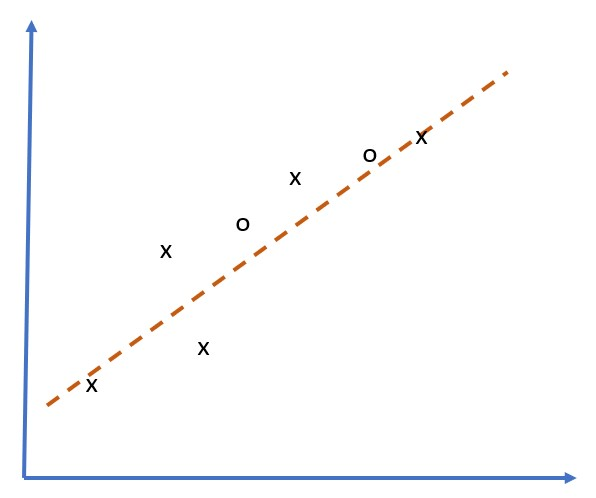
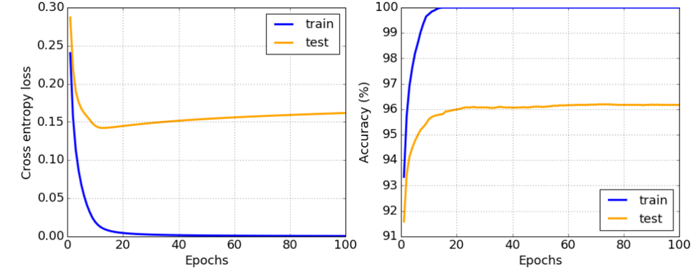

# Overfitting

Overfitting is an extremely important concept in machine learning, and it is very important to get it right!

Consider the following problem of approximating 5 dots (represented by `x` on the graphs below):

 | 
-------------------------|--------------------------
**Linear model, 2 parameters** | **Non-linear model, 7 parameters**
Training error = 5.3 | Training error = 0
Validation error = 5.1 | Validation error = 20

* On the left, we see a good straight line approximation. Because the number of parameters is adequate, the model gets the idea behind point distribution right.
* On the right, the model is too powerful. Because we only have 5 points and the model has 7 parameters, it can adjust in such a way as to pass through all points, making training the error to be 0. However, this prevents the model from understanding the correct pattern behind data, thus the validation error is very high.

It is very important to strike a correct balance between the richness of the model (number of parameters) and the number of training samples.

## Why overfitting occurs

  * Not enough training data
  * Too powerful model
  * Too much noise in input data

## How to detect overfitting

As you can see from the graph above, overfitting can be detected by a very low training error, and a high validation error. Normally during training we will see both training and validation errors starting to decrease, and then at some point validation error might stop decreasing and start rising. This will be a sign of overfitting, and the indicator that we should probably stop training at this point (or at least make a snapshot of the model).

## How to prevent overfitting

If you can see that overfitting occurs, you can do one of the following:

 * Increase the amount of training data
 * Decrease the complexity of the model
 * Use some [regularization technique](../../4-ComputerVision/08-TransferLearning/TrainingTricks.md), such as [Dropout](../../4-ComputerVision/08-TransferLearning/TrainingTricks.md#Dropout), which we will consider later.

## Overfitting and Bias-Variance Tradeoff

Overfitting is actually a case of a more generic problem in statistics called [Bias-Variance Tradeoff](https://en.wikipedia.org/wiki/Bias%E2%80%93variance_tradeoff). If we consider the possible sources of error in our model, we can see two types of errors:

* **Bias errors** are caused by our algorithm not being able to capture the relationship between training data correctly. It can result from the fact that our model is not powerful enough (**underfitting**).
* **Variance errors**, which are caused by the model approximating noise in the input data instead of meaningful relationship (**overfitting**).

During training, bias error decreases (as our model learns to approximate the data), and variance error increases. It is important to stop training - either manually (when we detect overfitting) or automatically (by introducing regularization) - to prevent overfitting.

## Conclusion

In this lesson, you learned about the differences between the various APIs for the two most popular AI frameworks, TensorFlow and PyTorch. In addition, you learned about a very important topic, overfitting.

## 🚀 Challenge

In the accompanying notebooks, you will find 'tasks' at the bottom; work through the notebooks and complete the tasks.

## [Post-lecture quiz](https://victorious-sand-043ca7603.1.azurestaticapps.net/quiz/205)

## Review & Self Study

Do some research on the following topics:

- TensorFlow
- PyTorch
- Overfitting

Ask yourself the following questions:

- What is the difference between TensorFlow and PyTorch?
- What is the difference between overfitting and underfitting?

## [Assignment](lab/README.md)

In this lab, you are asked to solve two classification problems using single- and multi-layered fully-connected networks using PyTorch or TensorFlow.

* [Instructions](lab/README.md)
* [Notebook](lab/LabFrameworks.ipynb)
